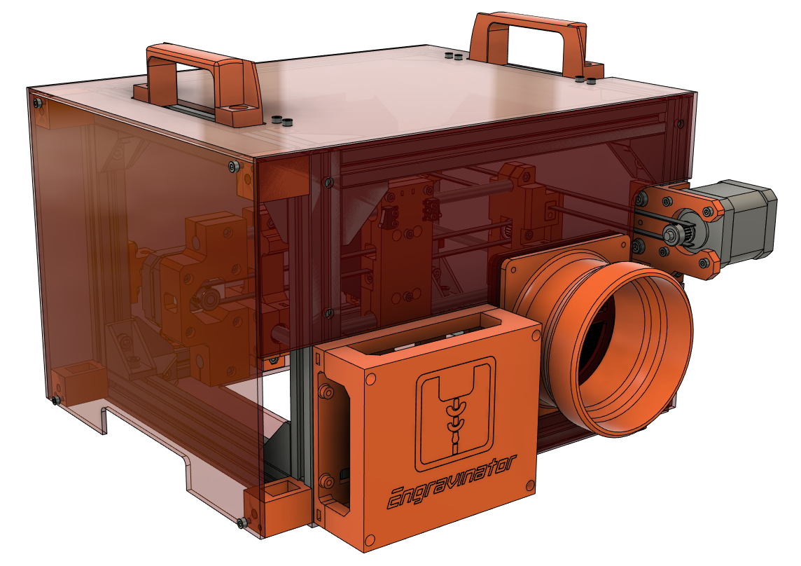

# 4-Inch Exhaust Duct Adapter

Is the 80mm exhaust fan and carbon filter just not cutting it? No worries, just print this 4-inch duct adapter and vent outside!

## Required Components

- Duct Adapter Printed Part - [4InchDuctAdapter.stl](4InchDuctAdapter.stl)
- 4x M3x10 bolts
- 4x M3 Nuts
- 4-inch flexible ducting
- 4-inch exhaust blower fan

## Assembly

- Print [4InchDuctAdapter.stl](4InchDuctAdapter.stl). We recommend 0.2mm layer heights with 20% infill. But it doesn't really matter.
- Remove the back panel from your Engravinator if it was already installed and remove the fan and filter holder.
- Use the M3x10 bolts and M3 nuts to mount the duct adapter to your Engravinator.
- Remount the back panel.

What, you were expecting more?

The rest is really up to you. We've had good luck with a generic 200CFM exhaust blower found on Amazon. Anything that's for a 4-inch duct hose will work. Connect one length of duct from the Engravinator to the blower (ideally using duct clamps but tape works too) then another length from the exhaust end of the blower to wherever you want to vent. Out a window works well.

If you are really stuck with no outside venting options we recommend using a large carbon filter canister such as this one: https://www.amazon.com/gp/product/B07B3RNW35/

This filter canister setup was used with great success for 2 solid days at ERRF 2019 with no complaints from anyone about fumes or smoke.