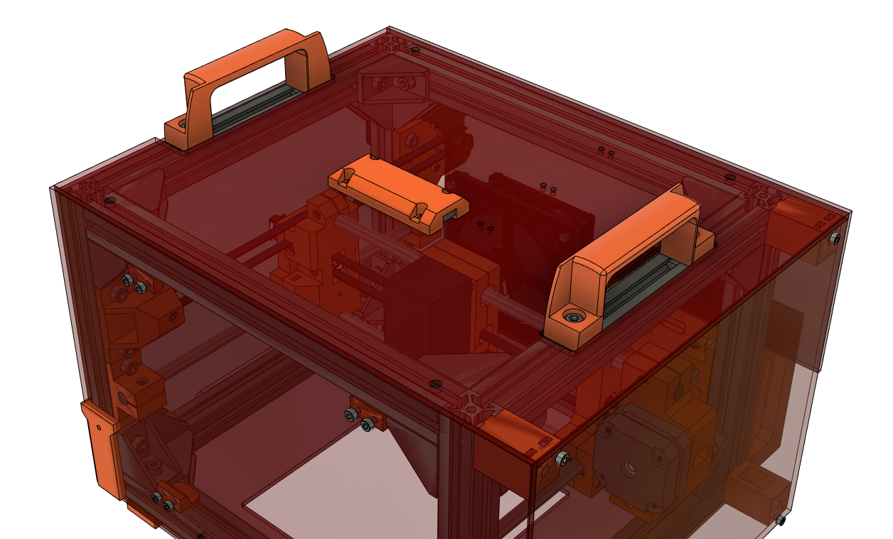

# LightBurn Camera

LightBurn has this [awesome feature](https://github.com/LightBurnSoftware/Documentation/blob/master/Using_a_Camera.md) that allows you to accurately place your designs using a calibrated camera view. Follow bellow to find out how to install a compatible camera on your Engravinator!

## Required Components

- Camera Mount (3D Printed) - [LightBurnCameraMount.stl](LightBurnCameraMount.stl)
- New top panel, cut from [TopPanel_LightBurnCamera.dxf](TopPanel_LightBurnCamera.dxf)  in 3mm 2422 Amber acrylic.
- [LightBurn Camera 90&deg;](https://lightburnsoftware.com/collections/cameras/products/lightburn-camera?variant=13886769922093)
- 2x M1.7x3mm Screws (or just use hot glue)
- 4x M3x10 bolts
- 4x M3 Nuts
- 4x M5x10 bolts
- 4x [HNTP5-5](https://us.misumi-ec.com/vona2/detail/110302247640/?HissuCode=HNTP5-5&PNSearch=HNTP5-5&KWSearch=HNTP5-5&searchFlow=results2type) Spring nuts
- Small zip ties

## Assembly

This one is pretty simple:

- Before anything, there is a small dab of glue holding the camera lens at a specific focus. Pick that off with some small tweezers so we can focus it later.
- Print the camera mount listed above. 0.2mm layer heights, 20% infill.
- Mount the LightBurn camera in it with the M1.7 screws or, honestly, just use a couple dabs of hot glue. Those screws are a pain to find.
- Mount the camera mount to the new top acrylic panel using the M3x10 bolts and M3 nuts. See picture above for orientation.
- Connect the USB cable to the camera and hold it down using the 3 other sets of holes in the top panel and some zip ties.
- Mount the top panel to the frame using the M5x10 bolts and HNTP5-5 extrusion spring nuts. The top panel MUST be firmly mounted and not be allowed to shift at all.

That's it, now it just needs to be setup with LightBurn. All of the LightBurn camera docs can be found here: https://github.com/LightBurnSoftware/Documentation/blob/master/Using_a_Camera.md

One thing of note is that the lens calibration step requires a calibration pattern to be printed out and placed various places inside the machine. But it was never intended for a machine this small. We recommend printing out the calibration pattern at 25% size and then taping it to a small piece of stiff cardboard, roughly the size of a business card.
