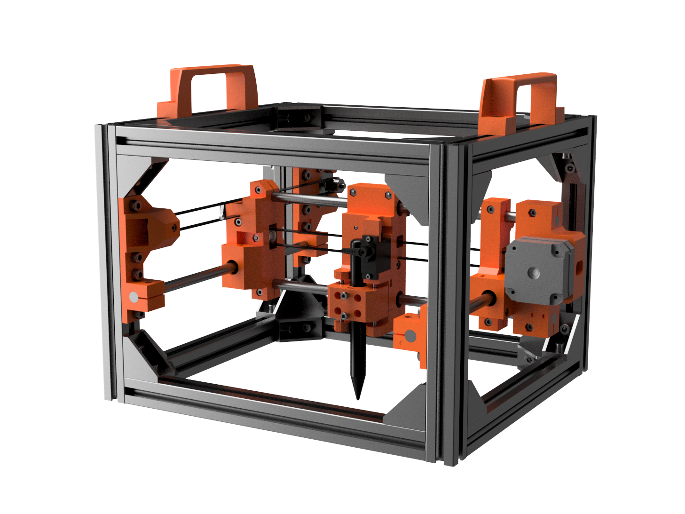
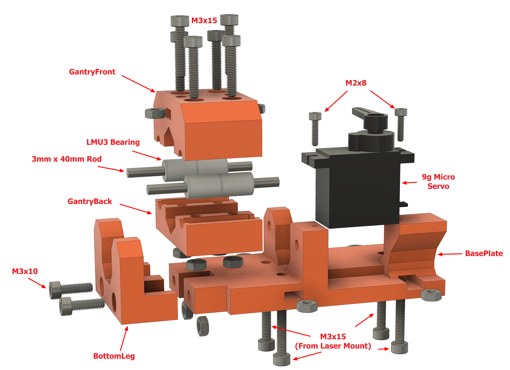
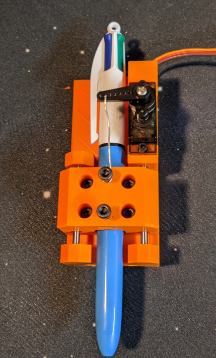
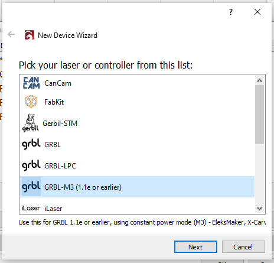
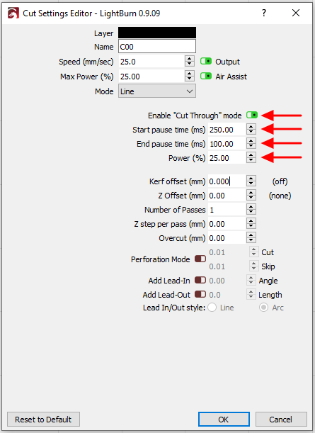

# Pen Lift Mechanism

So, maybe lasers aren't your thing and you prefer ink? Just install this pen lift mechanism that is a drop in replacement for the laser module :)



## Required Components

- Printed Components (Use [PenLiftPrintPlate.stl](Printed_Parts/PenLiftPrintPlate.stl))
- [9g Micro Servo](https://www.amazon.com/gp/product/B07NV476P7/)
- 4x [LMU3 Bearings](https://us.misumi-ec.com/vona2/detail/110300026540/?HissuCode=LMU3)
- 2x [3mm Diameter x 40mm linear rod](https://us.misumi-ec.com/vona2/detail/110302634310/?HissuCode=PSFJ3-40)
- 12x M3 Nut (See Engraviator [BOM Guide](https://engravinator.com/mk1/BOM_Guide.html))
- 2x [M3x10 Bolt](https://us.misumi-ec.com/vona2/detail/221000551286/?HissuCode=CSH-ST-M3-10&PNSearch=CSH-ST-M3-10&KWSearch=CSH-ST-M3-10&searchFlow=results2type)
- 2x [M2x8 Bolt](https://us.misumi-ec.com/vona2/detail/221000551286/?HissuCode=CSH-ST-M2-8&PNSearch=CSH-ST-M2-8&KWSearch=CSH-ST-M2-8&searchFlow=results2type)
- 6x [M3x15 Bolt](https://us.misumi-ec.com/vona2/detail/221000551286/?HissuCode=CSH-ST-M3-15&PNSearch=CSH-ST-M3-15&KWSearch=CSH-ST-M3-15&searchFlow=results2type) (4 more will be reused from laser mount)
- Thin wire or fishing line
- Pen up to 12mm in diameter

## Assembly

This one is pretty simple, so in lieu of the full step-by-step we'll provide this annotated and exploded view of the entire assembly.



The basic steps are:

- Sandwich the four LMU3 bearings between `GantryFront` and `GantryBack`, then secure with four each of the M3x15 bolts and the M3 nuts. On GantryFront this is the 4 outer holes.
- Slide each of the 3mm rods into the bearings and then press the rods into the recessed holes on `BasePlate`.
- Take `BottomLeg` and match up the other ends of the rods with its recessed holes while lining it up with `BasePlate` and push them together as much as possible.
- Now insert two M3 nuts into the slots on the back of `BasePlate` and then two M3x10 bolts through the bottom of `BottomLeg` and tighten against those nuts. This will pull everything together and fully seat the 3mm rods.
- In `GantryFront` there are two slots for M3 nuts. Insert a nut into each and then thread in an M3x15 bolt from the top for each. These are to hold onto the pen, so do not tighten all the way yet.
- Use the M2x8 bolts to secure the micro servo.
- We recommend installing a single servo arm as shown. We will discuss connecting this to the gantry in the usage details below.

## Mounting

The pen lift mechanism goes in place of the laser.

- Simply undo the four M3x15 bolts on the back of the X-axis laser mount but leave the bolts in place. Just remove the laser. 
- Then insert an M3 nut into each of the 4 slots on the side of `BasePlate`.
- Mount the pen lift on the X-axis, matching up the holes with those M3x15 bolts. Tighten all bolts to secure.
- Finally you will need to run the servo cable in place of (or along side) the laser cable back to the controller. See the [Controller section](https://engravinator.com/mk1/build/06.Controller.html) of the build guide for more details on wiring.

## Firmware

Unfortunately it's not possible to just use stock Grbl to control a servo. There are two types of modified Grbl to control this mechanism. One controls the servo with the laser power commands and the other controls the servo as a virtual Z axis. We will be only discussing the former here. You can find firmware that uses the latter on this [GitHub repo])(https://github.com/bdring/Grbl_Pen_Servo).

However, for the Engravinator we recommend you use the firmware that we have created, which is been thoroughly tested and will be detailed here. Note: we will be assuming you are using the [Platypus](https://maniacallabs.com/products/platypus/) controller below.

First, follow the instructions here: https://github.com/ManiacalLabs/grbl/tree/builds
And install the firmware called `m3_servo`:

- [Precompiled Hex](https://github.com/ManiacalLabs/grbl/tree/builds/release/m3_servo)
- [Source](https://github.com/ManiacalLabs/grbl/tree/builds/code/m3_servo)

You will then need to change a few config items. Enter these commands (without the comment) in your controller serial terminal.

- Disable laser mode `$32=0`
- Decrease default X speed: `$110=2000.000`
- Decrease default Y speed: `$111=2000.000`

You **MUST** disable laser mode, otherwise it will move with the pen down when it shouldn't. The last two are optional but you really don't want to be going fast with a pen. This will limit it for you.

That's it, your controller is ready to rock a servo!

## Pen Setup

Almost there, we promise! The first thing we need to do is get the pen installed and hook up the servo to the gantry. 

With your Engravinator on, connected to your control software of choice, and homed: open your serial terminal and enter: 

`M3 S0`

This will move the servo to the "neutral position". At this point, make sure the servo arm is pointing to "9 o'clock" as shown in the picture below: 



If the arm is not in that position, unscrew it and move it to the correct position before screwing it in again.
With the arm there, take either a piece of ~22 gauge wire (without the insulation) or some fishing line and connect it between the servo arm and the top bolt as shown above. Using fishing line will provide no downward pressure whereas a wire will provide a little. We prefer the wire because it will also bend a bit if the servo moves down too far and basically "auto adjust".

Now, enter the command:

`M3 S250`

This will move the arm to about 1/4 of full. You might think you'd want to fully extend it but that's not the case. Ideally the pen should only move up and down a tiny amount, which allows you to spend less time deploying and stowing the pen.

Now, loosen the two bolts in the center of the gantry and insert your pen of choice from the top (without the cap of course). Let it simply rest on the surface below your Engravinator. Tighten both bolts so that it holds the pen securely.

Now enter `M5` in the terminal to "stow" the pen.

## Control

This will be a little different depending on what software you choose. But no matter what you'll need to ensure that you have it program in a delay for every `M3` (pen down) command. The easiest way to do this is with the `G4` (dwell) command.

Some programs, such as LaserWeb will allow you to set "Tool On" and "Tool Off" commands. In this case, you would use:

```
; tool on
M3 S250
G4 P250

; tool off
M5
G4 P100
```

Note that the `Sxxx` value must be whatever you used above to setup your pen. Because that's where your pen is touching the paper.

The `G4 Pxxx` values are a delay where the number is milliseconds. In our testing we've found that 250ms is usually enough to make sure the pen is fully deployed and 100ms is enough to ensure it's no longer touching the surface before moving again.

These values will change depending on your particular usage. For example, if you notice that it's skipping part of a line after deploying the pen, increase the tool on delay. Or if you see that it's drawing after it should've stopped, increase the tool off delay. The idea is to have those values be as small as possible, as to not waste time.

That's pretty much it, assuming your software let's you override tool on / tool off or otherwise set delays. Now you can use it just like you would for a laser.

## LightBurn

We really love [LightBurn](https://lightburnsoftware.com) here at Maniacal Labs for all our lasering needs, but for pen use it requires a few tweaks. Mainly this is because there's currently no way to override the tool on/off commands as described above. But no worries, it's an easy fix.

First, you need to make sure that it won't use M4 power commands which means using a different GRBL profile than then one described in the [Platypus LightBurn docs](https://github.com/ManiacalLabs/Platypus/blob/master/docs/LightBurn.md). At this point we recommend creating a completely new profile to be used with the pen lift. Follow those LightBurn docs for the Platypus but when it asks you to choose a laser type, choose `GRBL-M3 (1.1e or earlier)`:



Follow the rest of the Platypus docs and use all the same options otherwise. Now you just need to ensure there's a delay on pen down/up. In your cut settings you need to enable the "Cut Through" mode, as shown below:



The four annotated items are what's imported. 

- "Cut Through" must be turned on
- "Start pause time" is the delay on pen down
- "End pause time" is the delay on pen up
- "Power" should always be whatever "Max Power" at the top of the dialog is set to. Unfortunately you always have to set both and make sure they are the same.

Since power is in percent in LightBurn, note that 25% here is the same as `S250` above, assuming that your power range is configured for 0-1000 in Grbl (the default).

One thing we've found is that you can increase the power setting a little bit from what you used when installing the pen to provide a little more pressure (assuming you used wire instead of fishing line). So, for example, set it to 30% when the pen was installed at 25%.

That's it! You should be good to go with LightBurn.